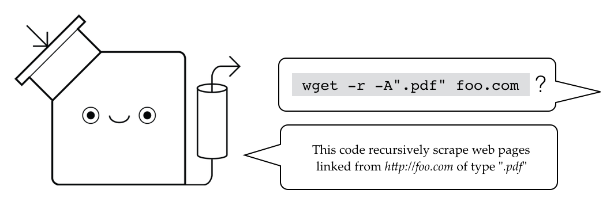

# A Server for Explaining the Unexplained

This Tutorons server provides a framework for running
Tutorons, or code explainers, to add tooltip-style
explanations to arbitrary web pages.

This project provides a lightweight implementation of
the server to make it easy to get started.



For a heavier Tutorons server that supports more languages
(but is tricker to set up), see
[andrewhead/tutorons-server](https://github.com/andrewhead/tutorons-server).

## Launch the server to explain code

### Get the source

```bash
git clone --recursive https://github.com/andrewhead/tutorons-base.git
cd tutorons-base
```

This clone includes both the server, and a reference
implementation of on Tutoron: one that explains Python
built-ins.  This Tutoron is currently needed for checking
some of the logic of successful requests (though we might
phase it out later).

### Install the dependencies

This tutorial assumes you are using Python 2.7.  If you
aren't, this code probably won't run.

We recommend installing all dependencies into a virtual
environment so you can replicate our runtime configuration
without clobbering the environment for your other projects.

```bash
pip install virtualenv
virtualenv venv                  # create virtual environment
source venv/bin/activate         # start virtual environment
pip install -r requirements.txt  # install deps
```

### Start the virtual environment

For all Django commands, if you're using a virtual
environment, it **must** be initialized before you run the
commands.  Otherwise, the scripts won't be able to find the
dependencies you downloaded to the virtual environment.

Before you run **any** of the below commands, make sure that you
have activated the virtual environment:

```bash
source venv/bin/activate
```

### Generate a secret key for the project

The secret key needs to be instantiated for any Django
management commands.

```bash
DJANGO_SETTINGS_MODULE=tutorons.settings.dev \
  python manage.py createsecretkey
```

When you run this command the first time, you will see this
output.  Don't worry, this is expected.

```
Exception when loading secret key ([Errno 2] No such file or directory: u'/Users/andrew/.tutorons/secret.key')
Using placeholder secret key.
Make sure that a secret key file is created at the location of SECRET_KEY_FILE (currently /Users/andrew/.tutorons/secret.key) by running:

DJANGO_SETTINGS_MODULE=tutorons.settings.dev python manage.py createsecretkey

If that's what you're doing right now, then kudos!
```

### Set up the local database

The Tutorons server saves all queries made to it to a local
database.  This command sets up that database.

```bash
DJANGO_SETTINGS_MODULE=tutorons.settings.dev \
  python manage.py migrate
```

### Test the core

This command will run tests for the Tutorons core as well as
all additional installed modules (in this case, the Python
built-in module).

```bash
./runtests.sh
```

### Start the server

To start the server, run the following command.  Once it is
running, you can see it running and producing explanations
by going to `http://localhost:8002`.

```bash
./rundevserver.sh
```

A port number can be provided as an argument to
`rundevserver.sh` if you want to run the server on a
different port.

### More information

A tutorial on developing your own Tutoron is planned.
Though if you really need one, contact me and ask me to
hurry up.  I can see what I can do.

## Contributing

### Contribution process

1. Create a new branch for doing your work:
   `git checkout -b <branchname>`
2. Do your local work and commit.  All new features or bug
   fixes should have tests.
3. Run the test suite to make sure everything still passes
4. Push your branch
4. Submit a pull request to merge into master ([see
   here](https://help.github.com/articles/using-pull-requests/)).
   Assign the pull request to someone else on the team who
   should verify the style and design choices of your code.
6. Respond to any comments from reviewers
7. Once your pull request is accepted, merge your pull
   request into master
8. Check out the master branch and verify that all tests
   still pass

### Installing dependencies

When installing dependencies, install them to a virtual
environment instead of your global Python library.  Here's
how you can do this.

```bash
pip install virtualenv
virtualenv venv           # create a new virtual environment at folder "venv"
source venv/bin/activate  # start the virtual environment
pip install -r requirements.txt
```

All pull requests should include an up-to-date version of
the requirements.  If you installed anything new, make sure
to include a new requirements file in your commit:

```bash
pip freeze > requirements.txt
```

*Don't install any dependencies that aren't released under a
permissive open source license*.  This code has reworked so
that it can be released under BSD so it can fit others'
development needs.  We don't want to change the conditions
under which it is currently licensed.

### Running unit tests

Before you commit, you need to make sure all existing tests
are still running.  The easiest way is to do the following
from the main directory:

```bash
./runtests.sh
```
